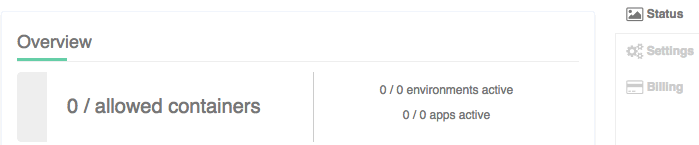

page_title: Shippable Formations Overview | Documentation | Shippable
page_description: Overview of Shippable Formations
page_keywords: formations,multi containers, microservices, Continuous Integration, Continuous Deployment, CI/CD, testing, automation

# Overview

## How do you get here?

- Login to [Shippable](https://shippable.com)
- On the Landing page, click on **Formations**
- Select your Formation

## Formation Status

If you are new to Formation, you will get here after you have purchased a Formation plan and you will see this.

The next step for a new Formation is to add components by going to the [Settings](formation_settings.md)

If you have existing formations, this is where you can see the status of all the Services Instances deployed by environment.

