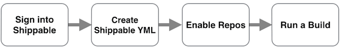
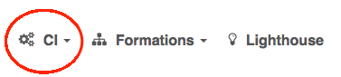
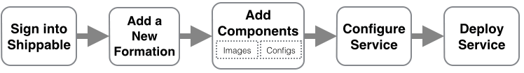
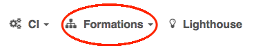

page_title: Learn About What Makes Shippable Great | Documentation | Shippable
page_description: Code examples, FAQs, language & platform support
page_keywords: containers, lxc, Docker, Continuous Integration, Continuous Deployment, CI/CD, testing, automation

# Overview

## What is Shippable?

Shippable is a SaaS platform for developers and DevOps teams that significantly reduces the time taken for code to be built, tested and deployed to production.

Shippable is comprised of two products that enable you to ship code faster:

**Shippable CI/CD:** Shippable CI/CD is our Continuous Integration and Deployment Platform. It uses **Build Minions**, which are Docker based containers to run your workloads. After building and testing your code, you can push your Docker image to Docker Hub, Google Container Registry, or any other private registry.

Go to [Shippable CI/CD overview](ci_overview.md) to learn more.

**Shippable Formations** Shippable Formations gives developers an easy way to provision, configure, and deploy multi-container Dev and Test clouds (environments) with zero DevOps code. It is fully integrated with the updated Shippable CI/CD platform, and together, they create an automated, frictionless pipeline from source control to full-topology environments that can mimic your production environment or represent any combination of software component versions you'd like to deploy.

Go to [Shippable Formations Overview](formations_overview.md) to learn more.

*****

## Quick Start: Run a build



### Step 0: Prerequisite

Shippable uses either your [GitHub](https://github.com) or [Bitbucket](https://bitbucket.org) account to authenticate. You must have your source code in one of these two repos to sign up for Shippable.

### Step 1: Sign in to Shippable

To sign in, visit the [Shippable website](https://www.shippable.com),
click **Login**, and choose between GitHub or Bitbucket auth. This will take you to either the GitHub or Bitbucket Sign In page, where you enter your credentials.

Click `Authorize Application` on GitHub or `Grant access` on Bitbucket to allow access to repos. The [access policy](permissions.md) page has more details on Shippable's access policies.

### Step 2: Create YML file

Create a shippable.yml file at the root of the repository you want to build with Shippable.

Your yml needs a couple of entries at the very minumum - the language and the version(s) of the language you want to test against. We will use defaults for the other settings in this case.

```
# language setting
language: nodejs

# version numbers, testing against two versions of node
node_js:
    - 0.10.25
    - 0.11
```


### Step 3: Enable CI/CD for repos

To enable a repository for CI/CD:

- On the Shippable landing page, click on **CI**



- Find your subscription from the dropdown and go to your Subscriptions page
- Click on the  to enable a new project
- Find the repo you want to enable and click on the  icon
- This will bring you back to the project dashboard and you can see your enabled project there

### Step 4: Run the build

- On the Project Page, click on the `Run Build` icon to run a manual build
- You can view the build status on the console in the build page
- The status is updated as soon as the build completes

>This is a very basic version of a build. Learn how to [customize your build further](build_case2.md)

*****

## Quick Start: Create a Formation



### Step 0: Prerequisite

Shippable uses either your [GitHub](https://github.com) or [Bitbucket](https://bitbucket.org) account to authenticate. You must have one of these two accounts to sign into Shippable.

### Step 1: Sign in to Shippable

To sign in, visit the [Shippable website](https://www.shippable.com),
click **Login**, and choose between GitHub or Bitbucket auth. This will take you to either the GitHub or Bitbucket Sign In page, where you enter your credentials.

Click `Authorize Application` on GitHub or `Grant access` on Bitbucket to allow access to repos. The [access policy](permissions.md) page has more details on Shippable's access policies.

### Step 2: Add a new Formation Subscription

- Add a Payment Method: Click on Account Settings Icon on the top nav bar. Select the **Cards** tab and add a payment method
- Connect your Docker Registry to Shippable: Click on the **Integrations** tab under Account Settings and add Docker Hub or GCR credentials that allow us to connect to the registry. Read the [instructions](integrations.md) on how to integrate

Now you are ready to add a Formation Subscription:

- On the Shippable Landing page, click on **Formations**

    

- Choose **Add Formation**
- Enter a name for your formation in the textbox
- Use the slider to select the number of containers for your plan
- Enter your billing address and billing email
- Select a payment method.
- Click Buy
- This will bring you to the [Formation Status page](formations_status.md)


### Step 3: Add Components

- Start by adding different components to your formation by clicking on the **Settings** tab and selecting the **Components** tab
- Add images to your formation by clicking on the .
- Create an environment by entering the name in the **Environments** section. We only need the name at this point
- Add the keys of your Config Variables against **Configurations**. The actual values will be entered when you are configuring an instance of your application.

### Step 4: Create and Configure Service(s)

- Go to the **Services** tab under **Settings** to create and configure your service
- Start by naming your service and clicking **Save**
- Add the images that are part of the service by clicking on 
- Add the config keys by clicking on  in the **Add Configs** section
- Select the environment you want to deploy this service to by clicking on  in the **Deploy** section
- You have now configured your Service.


### Step 5: Deploy Service(s)

- In the previous step, you configured your Service. Click on the icon next to the environment to configure and deploy an instance of your service to the environment
- Add the tags/versions of the images
- Add values for your Config Keys
- Select if you want to expose any port externally
- If you want multiple replicas of your instance, set the count in **replicas** appropriately
- Save and hit Deploy
- Verify you are deploying the correct image versions and click **Deploy Service**. Your service is now live!
- You can see the status of your service as **active** and live logs will stream to the console for all images in your services. On the status page, you can also see the IP address and port you can use to connect to your service

*****


## FAQ

### How can I update my Shippable plan?

Shippable CI/CD and Shippable Formations are 2 different subscriptions under your account. These need to be purchased separately.

First make sure you have a valid payment method on Shippable.

- Click on the Account Settings icon on the top nav bar
- Click on the **Cards** tab
- Add a new payment method by clicking on the 

To purchase additional containers for Shippable CI:

- Click on **CI** on the Shippable Landing page
- Click on your **CI Subscription** in the dropdown
- Go to the **Billing** tab
- Make sure your plan is set to `Multi-Tenant CI`
- Use the slider to select the number of containers you want for your subscription.
- Enter your payment details and click `Buy`
- Your CI Plan is now updated

To purchase containers for a new or existing Shippable Formation:

- Click on **Formations** on the Shippable Landing page
- Click on **Add a new formation** in the dropdown
- This will take you to our payment page. Choose `Multi-Tenant Formation` as your plan
- Use the slider to select the number of containers you want for your formation
- Enter your payment details and click `Buy`
- You are ready to start on your new formation

To update containers in an existing Shippable Formation:

- Click on **Formations** on the Shippable Landing page
- Choose the Formation that you want to update
- Go to the **Billing** tab
- In the first section, choose `Multi-Tenant Formation` as your plan
- Use the slider to select the number of containers you want for your formation
- Enter your payment details and click `Buy`
- Your plan is now updated


### Why can't I see some of my repositories in my Shippable account?

This happens due to one of the following reasons:

- You haven't enabled private repositories in your Shippable account. Go to [Account Settings](account_settings.md) and in the **GitHub Identity** section, click on the **Private Repos OFF** icon. This is a one-way toggle button to turn on Private Repos for your GitHub account.
- Your account hasn't yet been synced with the latest permissions from GitHub. To force sync your account, go to your Account Settings and click on the `Force Sync` icon next to your Account Id.
-  You're a Bitbucket user and you have mercurial repositories. We do not support mercurial at this time, so you will need to convert them to git or use another platform for CI/CD.

Visit our [FAQ Page](faq.md) for answers to more frequently asked questions.

