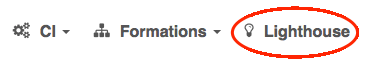

page_title: Shippable Lighthouse Image Watcher | Documentation | Shippable
page_description: How to watch images using Shippable's Lighthouse Feature
page_keywords: lighthouse, shippable ci, documentation, shippable, watch docker images

# Lighthouse: Image Watcher

## Overview

Have you ever wasted your time debugging a broken build only to realize a few frustrated hours later that it was due to something that changed in one of the images you depend on?

Lighthouse to your rescue!

Lighthouse is available to all users of Shippable (yes, for free). Using this feature, you can add any image from any registry that you want to track and get notified via email when there is an update. It is a simple set up and we will be adding more functionality to this feature over time - so keep a watch on our watcher.

Today, we support watching images that are hosted on either Docker Hub or Google Container Registry.

* * * * *

## How do you get here?

- Login to [Shippable](https://shippable.com)
- Click on **Lighthouse** on the top nav bar

    

## Permissions

Lighthouse is available to all users for Shippable to watch any number of images for free!

## Adding an image to the Lighthouse

To add an image to Lighthouse and receive notification when the image is updated in the registry, follow the steps below.

### Step 0: Prequisite: Integrations

Before using Lighthouse, make sure you are set up with the following Account Integrations.

1. Connect your Shippable Account to either Docker Hub or GCR using these [instructions](integrations.md).

2. Set up an email for Lighthouse to receive notifications by turning on a [Notification Integration](integrations/#lighthouse-notification)

### Step 1: Add an image to Lighthouse

- On the Lighthouse page, fill in the details as below:
  - Image Name: `your_repo_name/image_name` (the image from either DockerHub or GCR)
  - Integration: The Account Integration Name that you created to connect to the registry
  - Click on the `Save` Icon
  - You will see the `Sync Status` getting updated. If we are successfully able to sync, you will see the status changing to `success`

### Step 2: Configure Notifications for the Lighthouse Image

- Click on the image_name to go to the Image Details Page
- On the **Notification Integrations** section, you will see the list of notification emails you configured within  your account to receive emails in Step 0
- Use the toggle button to turn ON the emails that should receive notifications

## Tags

Lighthouse periodically polls the registry and the tags are updated when there is any update to the image in the source registry. You will see the latest tag against the image when the image is synced.

## Updating an Image on Lighthouse

To update an image or change the notification settings:

 - Go to the Lighthouse page
 - You will see the list of images being watched on the Lighthouse Dashboard
 - Click on the image_name to update the notification setting

## Deleting an Image on Lighthouse

To delete an image on lighthouse:

 - Go to the Lighthouse page
 - You will see the list of images being watched on the Lighthouse Dashboard
 - Click on the  icon at the top of the table
 - Now you can choose the images you want to delete by clicking on the  icon against each of the images and clicking confirm.
