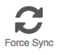

page_title: Shippable Account Settings | Documentation | Shippable
page_description: Account Settings, Integratons, Account Tokens, Credit Cards
page_keywords: containers, lxc, docker, Continuous Integration, Continuous Deployment, CI/CD, testing, automation, Tokens, account settings

# Linking your Bitbucket and GitHub Accounts

If you want to use Shippable to build both GitHub and Bitbucket repositories, you can connect the two accounts in this page to get a consolidated view of all your projects in one Shippable account.

To connect your accounts:

1. Sign in with the GitHub/BitBucket account that you want to be your primary account.
2. Click on the Account Settings icon on the top nav bar

3. If you signed in with GitHub, you will see an option to link Bitbucket under the **Bitbucket Identity Section**. Click on that and follow the authorization flow for Bitbucket.
4. If you signed in with Bitbucket, you will see an option to link GitHub under the **GitHub Identity Section**. Click on that and follow the authorization flow for GitHub.

Once your accounts are both connected to Shippable, you should see a
consolidated list of orgs and projects in your account. You can sign in
with either of your credentials after this point.

> **Tip**
>
> To see the linked account repositories updated immediately, click on the  icon on your [Account Information section](account_settings/#account-information)
