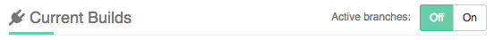

page_title: Shippable Project Dashboard| Documentation | Shippable
page_description: Explanation of the Shippable Project Dashboard
page_keywords: project dashboard, CI/CD, shippable CI, documentation, shippable, config, yml

# CI Project Dashboard

This page walks through the details on the Project Dashboard, which gives you details on your Current Builds and Build History for your project.

## How do you get here?

- Login to [Shippable](https://shippable.com)
- Click on **CI** on the Shippable Landing Page and choose the appropriate subscription
- This brings you to the [Subscriptions Dashboard](ci_dashboard). If your project is enabled, it will show up on the dashboard. If not, click on the  to enable your project
- Click on the project name

The Project Dashboard has panels for Current Build and Build History for each branch.

## Current Builds

The Current Build section shows the **commit** builds in progress for all branches in your project. If there are any PR builds, they will show up in the [PR builds](pr_builds) tab.

## Active Branches Toggle

By default, the dashboard only shows details about the active branch. If you would like to see all branches for the project, set the toggle to **OFF**

## Build History

You can view build history by branch. This is also where you can delete builds for any branch. Click on the **Delete Builds** button on the branch panel and choose the builds you would like to delete.

### Re-run builds

You can click on the `Re-run` icon to re-run the historical build with the same build info.

### Run a new build

Clicking on the 'Play' icon will kick off a new build for that project/branch.

## Build badge (NEEDS UPDATE AFTER BADGES ARE ADDED)

Badges will display the status of your default branch. You can find the build badges on the project's page. Click on the **Badge** button and copy the markdown to your README file to display the status of most recent build on your Github or Bitbucket repo page.

